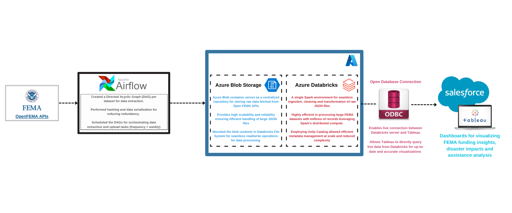

# FEMA Disasters Analysis: End-to-End Workflow Automation

## Overview
The FEMA Disaster Data Pipeline project aims to automate data ingestion, preprocessing, and visualization for disaster-related datasets. This pipeline efficiently handles data extracted from three FEMA APIs: Hazard Mitigation, Public Assistance, and Disaster Declaration. 
The project leverages Apache Airflow for workflow orchestration, Azure Blob Storage for secure data storage, Databricks for data cleaning and transformation, and Tableau for creating insightful dashboards. 
The end-to-end process ensures scalable, reliable, and real-time data analytics for disaster management.  
**Data Source**: [OpenFEMA Datasets](https://www.fema.gov/about/openfema/data-sets)  
[_Learn more about FEMA_](https://www.fema.gov/about/how-fema-works) 

---

## Apache Airflow: Workflow Automation
### Key Features:
1. **Environment Setup**:
   - Apache Airflow was deployed using Docker and configured in VS Code.
   - An isolated environment was created to manage DAGs, configurations, and logs.
   - [Learn More About Docker Setup for Airflow](https://airflow.apache.org/docs/apache-airflow/stable/howto/docker-compose/index.html).

2. **DAGs for Data Ingestion**:
   - Three DAGs were created to automate daily data extraction from FEMA APIs.
   - Configured connection establishment with Azure Blob Storage to upload extracted files.

3. **Serialization and Hashing**:
   - Implemented JSON file serialization and hashing to identify unique datasets and avoid duplicates.
   - For more details on serialization/deserialization, refer to [Serialization Techniques in Python](https://medium.com/@ashaicy/serialization-and-deserialization-techniques-in-python-deserialization-69beed1ed3ef).

4. **Scalability**:
   - Modular DAG structure ensures extensibility for additional APIs or datasets.

---

## Azure Blob Storage: Secure and Scalable Storage
### Benefits:
1. **Centralized Data Storage**:
   - All raw and cleaned datasets are securely stored in Azure Blob Storage containers.
   - Ensures easy integration with downstream processing platforms like Databricks.

2. **Cost-effective**:
   - Azure’s pay-as-you-go pricing model optimizes cost efficiency for high-volume data storage.

3. **Data Accessibility**:
   - Provides seamless access to data for batch and stream processing tasks.

---

## Databricks: Advanced Data Processing and Governance
Databricks was used extensively for the cleaning, processing, and storage of data extracted from FEMA's APIs. This section covers the integration and data engineering processes conducted in Databricks.

1. **Integration with Azure Blob Storage**:
   - Contents from Azure Blob Storage were mounted in Databricks to enable seamless access to raw JSON data.
The mounted data was used for preprocessing and cleaning, ensuring only high-quality, structured data was available for downstream analytics.

2. **Data Cleaning and Processing**:
   - Cleaning operations were implemented using PySpark's UDFs (User Defined Functions) for robust transformations.
Features such as replacing boolean values with readable "Yes/No," filtering invalid records, and handling missing values were applied.
Unified schemas were enforced across datasets for consistency.

4. **Data Storage in Delta Tables**:
   - The cleaned datasets were stored in Delta tables using the INSERT OVERWRITE method to prevent duplicate entries and maintain data integrity.
This approach ensured efficient updates and seamless compatibility with downstream Tableau visualizations.

5. **Unity Catalog for Governance**:
   - Unity Catalog was employed for fine-grained access control and centralized metadata management, enhancing data governance and security.

6. **GitHub Integration for Version Control**:
   - A fine-grained access token was created in GitHub for integrating the repository with Databricks, enabling effective version control.
GitHub REST API was leveraged to track changes and manage the repository efficiently.
This setup streamlined collaboration and ensured that all project updates were versioned and accessible.

For more information, explore the Databricks official documentation: [Databricks Guide](https://docs.databricks.com/en/index.html).

---

## ODBC Connection: Connecting Databricks to Tableau
### Key Features:
1. **Integration with Tableau**:
   - Established a connection between the Databricks server and Tableau using an ODBC driver.
   - This enabled direct visualization of Delta table data in Tableau dashboards.

2. **Real-time Insights**:
   - Allowed Tableau to fetch dynamic data updates from Databricks for accurate visualizations.

3. **Ease of Use**:
   - Simple configuration ensures secure and efficient data transfer.

**Learn More**: For setting up Tableau with Databricks, refer to the [Databricks and Tableau Integration Guide](https://docs.databricks.com/en/partners/bi/tableau.html).

---

## Tableau Visualizations
### Key Dashboards:
1. **Disaster Trends Analysis**:
   - Highlights the frequency and types of disasters over time.

2. **Funding Insights**:
   - Displays trends in federal obligations and project funding.

3. **Public Assistance Analysis**:
   - Analyzes the allocation and utilization of public assistance funds across regions.

### Benefits:
- Interactive dashboards provide actionable insights for disaster management and decision-making.
- Enables stakeholders to identify trends, allocate resources, and predict future funding needs effectively.

---

## Conclusion
This project showcases the automation and scalability achieved through modern data engineering tools like Apache Airflow, Azure Blob Storage, Databricks, and Tableau. The pipeline ensures efficient data handling, governance, and insightful visualizations for disaster-related datasets, making it a comprehensive solution for FEMA’s data analysis needs.

